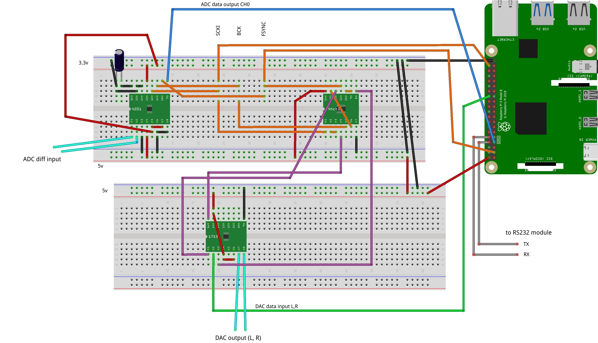

# digital-sound-mixer
A Raspberry Pi bare metal project to mix audio channels I'm very proud of! :D

Currently running on RPi 4B (Quad core Cortex-A72, ARM v8, 64-bit SoC @ 1.5GHz) with network boot by Ethernet cable and TFTP.

# Hardware

* PCM4201 24-bit ADC
* PCM1753 24-bit DAC
* 74HCT14 Schmitt triggers
* RS232 module for PC interface
* OPA2134 op amp (analog input not shown)
* filter/decoupling capacitors (not shown)

# Software

Currently, the source code provided here implements a sound mixer with these capabilities:

* each cores is running a different task
* Cache and MMU enabled
* 30 mono sound input channels
* buffer size of 32 samples
* sampling freq 48kHz
* samples are 32 bit floating point
* 4 band eq per channel (biquad filters)
* 1 compressor per channel
* 1 noise gate per channel
* one stereo master output

Entry point is in \_start.S, \_start label

# Build

In the build directory you can find a BAT file with my build commands.
You should install GCC toolchain provided by ARM (in my case it is gcc-arm-10.2-2020.11-mingw-w64-i686-aarch64-none-elf.tar)

# Problems

After a couple of months of work there is sound entering the mixer and going out :) 

BUT there are timing problems with the ADC and DAC signals that generate random glitches on the sound stream. These are due to the non-deterministic nature of Cortex-A72 and the real-time tight timing requirements apparently not compatible with this chipset architecture. 

ADC PCM4201 needs a ~24 MHz external system clock (SCKI) in master mode (ie. 512 * sampling freq of 48 kHz). SCKI clock is generated by a RPi's PLL ([timing.c](src/timing.c)) which turned out to be nicely accurate. "Master mode" implies that the IC then generates FSYNC and BCK clocks from SCKI. These timing signals are fed to the DAC, which implements a similar schema, but delayed thru the schmitt-triggers. Perhaps this is a bad idea.

At 48 kHz each sample arrives every ~ 21 uS (FSYNC signal, i.e. frame sync) and BCK (serial data clock) is ~6 MHz.

Randomly, the Rpi's GPIO polling awaiting for this FSYNC signal just takes too much time, and the bit stream that should be sent to the DAC gets out of sync. Therefore a glitch is created. It seems that the bus get super busy sometimes and this causes a GPIO read lag which ruins this polling performance.

Measured frequency and timing capabilities of RPi GPIO alone are ok, so to me this limitation doesn't seem to be in the GPIO circuitry but inside the buses within Broadcom's BCM2711 (RPi 4 chipset). Again, there are random glitches but general behaviour is as expected. This means that sending data by GPIO bit banging at 6 MHz is ok (check [core2.c](src/core2.c)).

There is a big chance that multiple protoboards and several "long" cables aren't suitable for this clock frequency ranges... A custom PCB would be much better.

An FPGA may be even better suited for this purpose.

# Some photos

