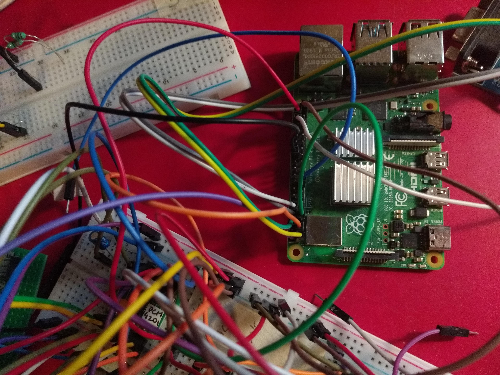
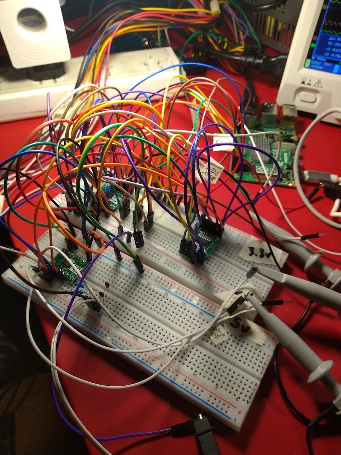
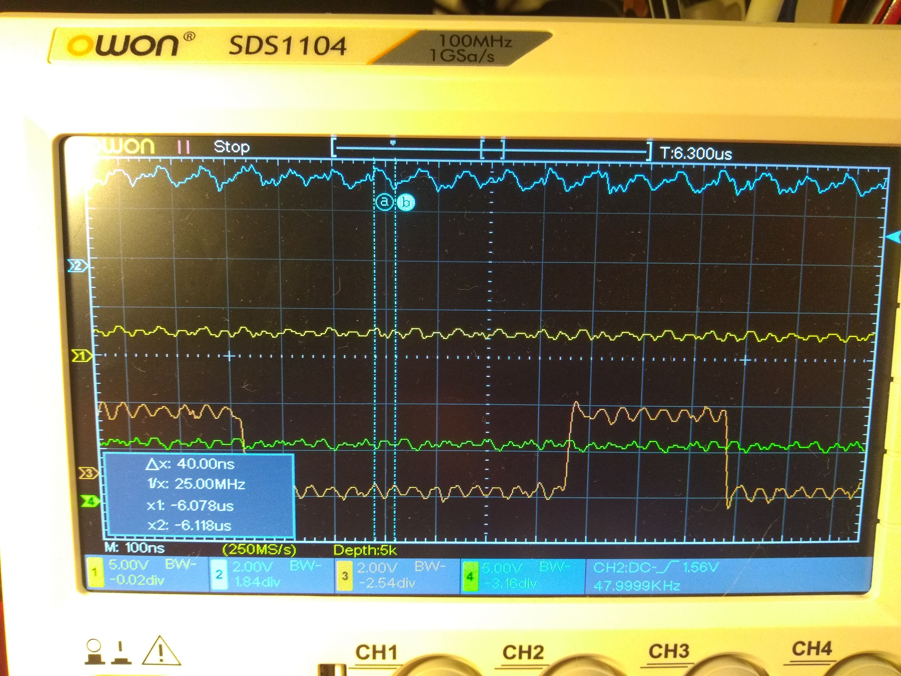

# digital-sound-mixer
A Raspberry Pi bare metal project to mix audio channels I'm very proud of! :D

Currently running on RPi 4B (Quad core Cortex-A72, ARM v8, 64-bit SoC @ 1.5GHz) with network boot by Ethernet cable and TFTP.

# Hardware

* PCM4201 24-bit ADC
* PCM1753 24-bit DAC
* 74HCT14 Schmitt triggers
* RS232 module for PC interface
* OPA2134 op amp

# Software

Currently, the source code provided here implements a sound mixer with these capabilities:

* each cores is running a different task
* Cache and MMU enabled
* 30 mono sound input channels
* buffer size of 32 samples
* sampling freq 48kHz
* samples are 32 bit floating point
* 4 band eq per channel (biquad filters)
* 1 compressor per channel
* 1 noise gate per channel
* one stereo master output

Entry point is in \_start.S, \_start label

# Build

In the build directory you can find a BAT file with my build commands.
You should install GCC toolchain provided by ARM (in my case it is gcc-arm-10.2-2020.11-mingw-w64-i686-aarch64-none-elf.tar)

# Problems

After a couple of months of work there is sound entering the mixer and going out :)

BUT there are timing problems with the ADC and DAC signals that generate random glitches on the sound stream. These are due to the non-deterministic nature of Cortex-A72 and the tight timing requirements apparently not compatible with this GPIO scheme. 

PCM 4201 generates a ~24 MHz system clock in master mode (ie. 512 * sampling freq of 48 kHz). Each samples arrives every ~ 21 uS (FSYNC signal, i.e. frame sync)

Randomly, the GPIO polling awaiting for this FSYNC signal just takes too much time, and the bit stream that should be sent to the DAC gets out of sync. Therefore a glitch is created.

An FPGA may be better suited for this purpose.

# Some photos

